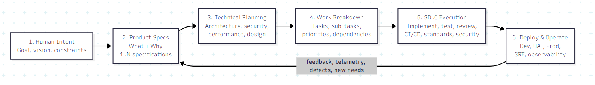
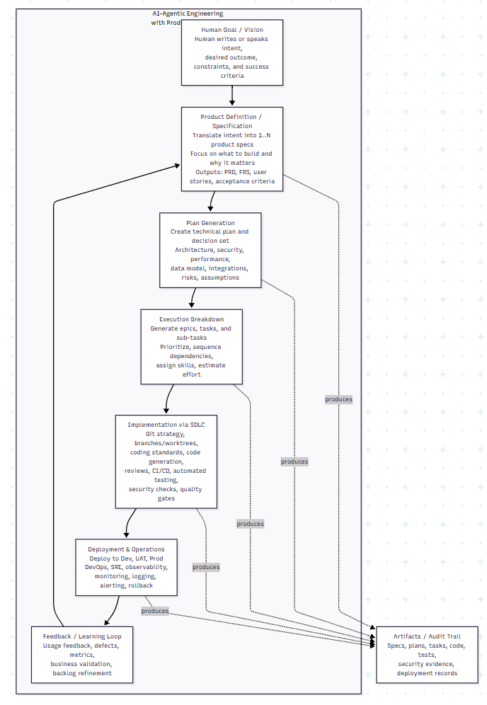

flowchart LR
    A[1. Human Intent Goal, vision, constraints]
    B[2. Product Specs What + Why 1..N specifications]
    C[3. Technical Planning Architecture, security, performance, design]
    D[4. Work Breakdown Tasks, sub-tasks, priorities, dependencies]
    E[5. SDLC Execution Implement, test, review, CI/CD, standards, security]
    F[6. Deploy & Operate Dev, UAT, Prod, SRE, observability]

    A --> B --> C --> D --> E --> F
    F -->|feedback, telemetry, defects, new needs| B

flowchart TD
    A[Human Goal / Vision Human writes or speaks intent, desired outcome, constraints, and success criteria]

    B[Product Definition / Specification Translate intent into 1..N product specs Focus on what to build and why it matters Outputs: PRD, FRS, user stories, acceptance criteria]

    C[Plan Generation Create technical plan and decision set Architecture, security, performance, data model, integrations, risks, assumptions]

    D[Execution Breakdown Generate epics, tasks, and sub-tasks Prioritize, sequence dependencies, assign skills, estimate effort]

    E[Implementation via SDLC Git strategy, branches/worktrees, coding standards, code generation, reviews, CI/CD, automated testing, security checks, quality gates]

    F[Deployment & Operations Deploy to Dev, UAT, Prod DevOps, SRE, observability, monitoring, logging, alerting, rollback]

    G[Feedback / Learning Loop Usage feedback, defects, metrics, business validation, backlog refinement]

    H[Artifacts / Audit Trail Specs, plans, tasks, code, tests, security evidence, deployment records]

    A --> B
    B --> C
    C --> D
    D --> E
    E --> F
    F --> G
    G --> B

    B -.produces.-> H
    C -.produces.-> H
    D -.produces.-> H
    E -.produces.-> H
    F -.produces.-> H

    subgraph Product_Owner_Focus [AI-Agentic Engineering with Product-First Focus]
        A
        B
        C
        D
        E
        F
        G
    end

